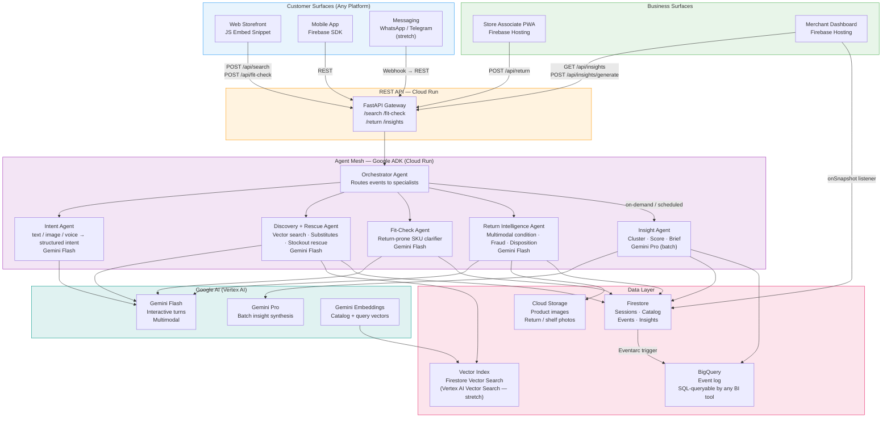
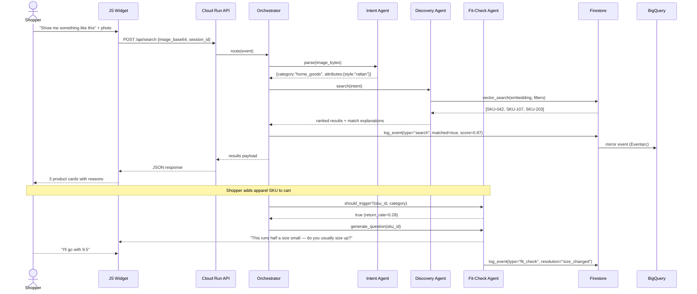

# OffGrid AI — Architecture Diagram

Render with any Mermaid-compatible viewer (GitHub, GitLab, Obsidian, mermaid.live).

---

## System Architecture

---

## Component Descriptions

### Customer Surfaces
- **JS Embed Snippet** (`embed/omnirerescue.js`): A single `<script>` tag that injects the OffGrid widget into any web storefront. No framework dependency. Sends events to the Cloud Run REST API.
- **Mobile (Firebase SDK)**: iOS/Android apps integrate via Firebase for real-time session sync and push notifications.
- **Messaging (stretch)**: WhatsApp/Telegram bots forward messages as webhook POST requests to the same REST API — no agent code changes required.

### Business Surfaces
- **Store Associate PWA**: Progressive Web App served from Firebase Hosting. Works on any browser/device. Handles shelf photo upload and return item analysis.
- **Merchant Dashboard**: Real-time updates via Firestore `onSnapshot`. Shows insight cards, event log, and revenue-at-risk metrics.

### REST API (Cloud Run)
FastAPI application. Stateless — all state lives in Firestore. Horizontal scaling handled by Cloud Run automatically.

### Agent Mesh (Google ADK)
- **Orchestrator**: Receives the normalized API payload, determines which specialist agent(s) to invoke, maintains session continuity.
- **Specialists**: Each agent has a focused system prompt, a fixed tool list, and an anti-hallucination guardrail. Agents never call each other directly — only through the Orchestrator.

### Data Layer
- **Firestore**: Primary operational store. Source of truth for sessions, catalog, events, and insights.
- **Vector Index**: Stores Gemini embeddings per SKU for semantic search. Firestore-native for MVP; Vertex AI Vector Search for production scale.
- **Cloud Storage**: Immutable image store for catalog photos, return item photos, and shelf images.
- **BigQuery**: Append-only event mirror. Enables SQL analysis and integration with any external BI tool (Looker, Data Studio, Tableau).

---

## Data Flow (Numbered Sequence)

