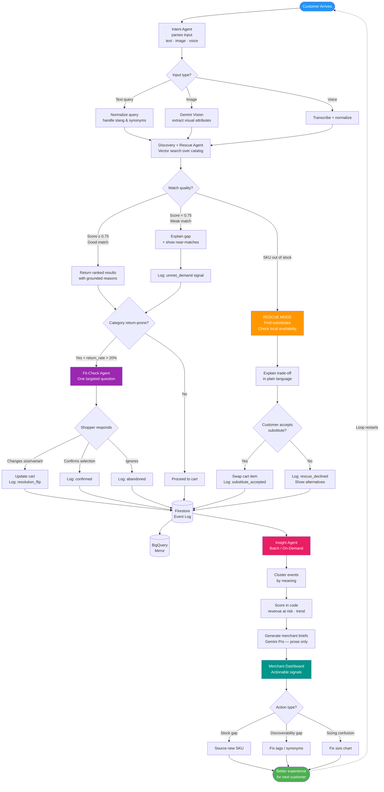
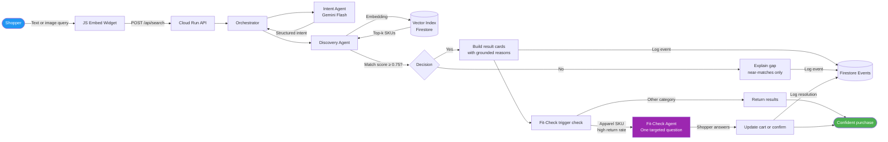
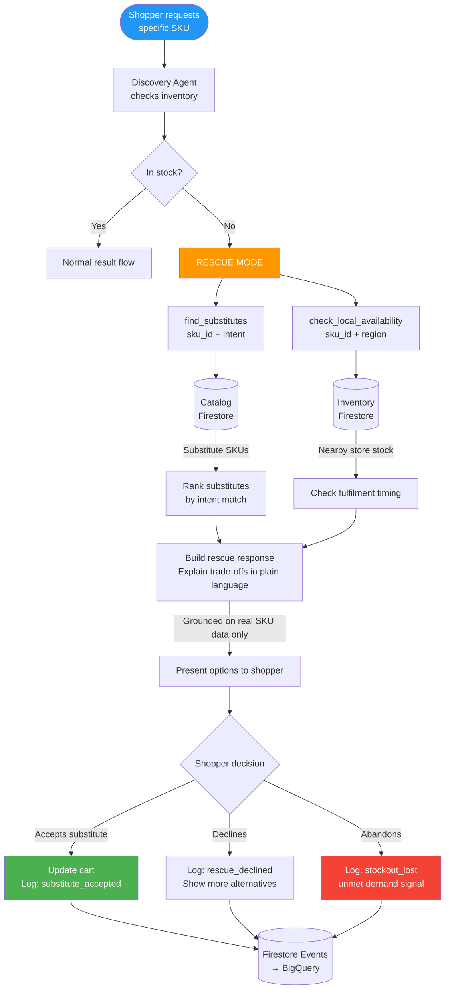
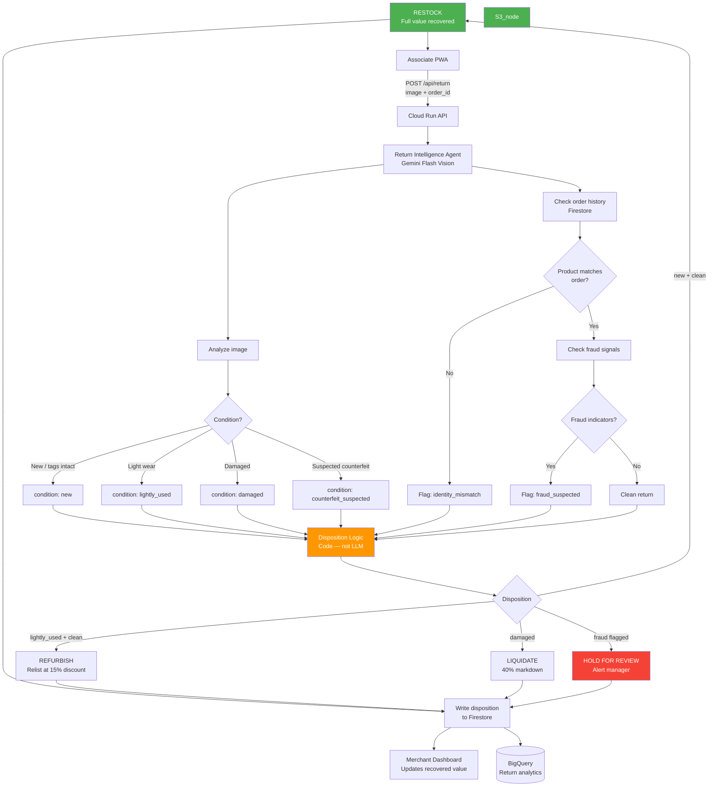
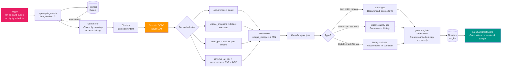
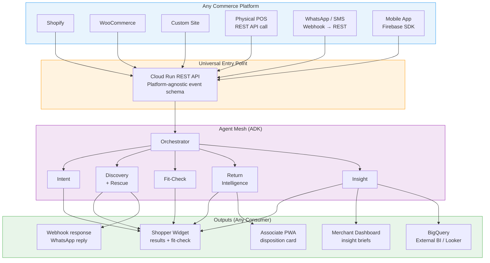
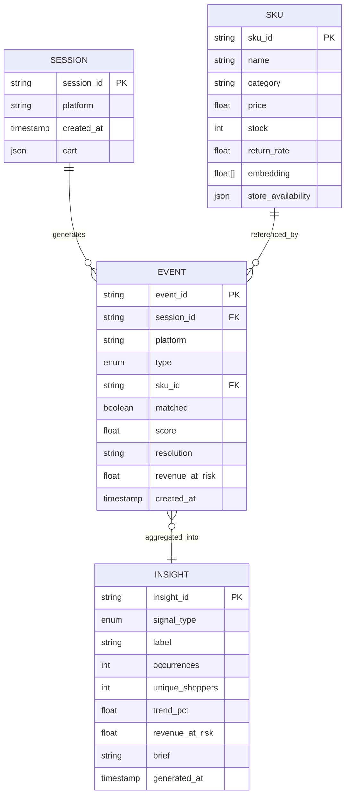

# OffGrid AI — Flow Diagrams

Render with any Mermaid-compatible viewer (GitHub, GitLab, Obsidian, mermaid.live).

---

## 1. The Rescue Loop (Core Flywheel)

---

## 2. Scenario 1 — Smart Discovery Flow

---

## 3. Scenario 2 — Stockout Rescue Flow

---

## 4. Scenario 3 — Return-to-Value Flow

---

## 5. Insight Agent Pipeline Flow

---

## 6. Cross-Platform Integration Flow

---

## Event Schema (Shared Across All Flows)

