# OffGrid AI — Flow Diagrams

Render with any Mermaid-compatible viewer (GitHub, GitLab, Obsidian, mermaid.live).

---

## 1. The Rescue Loop (Core Flywheel)

---

## 2. Scenario 1 — Smart Discovery Flow

---

## 3. Scenario 2 — Stockout Rescue Flow

---

## 4. Scenario 3 — Return-to-Value Flow

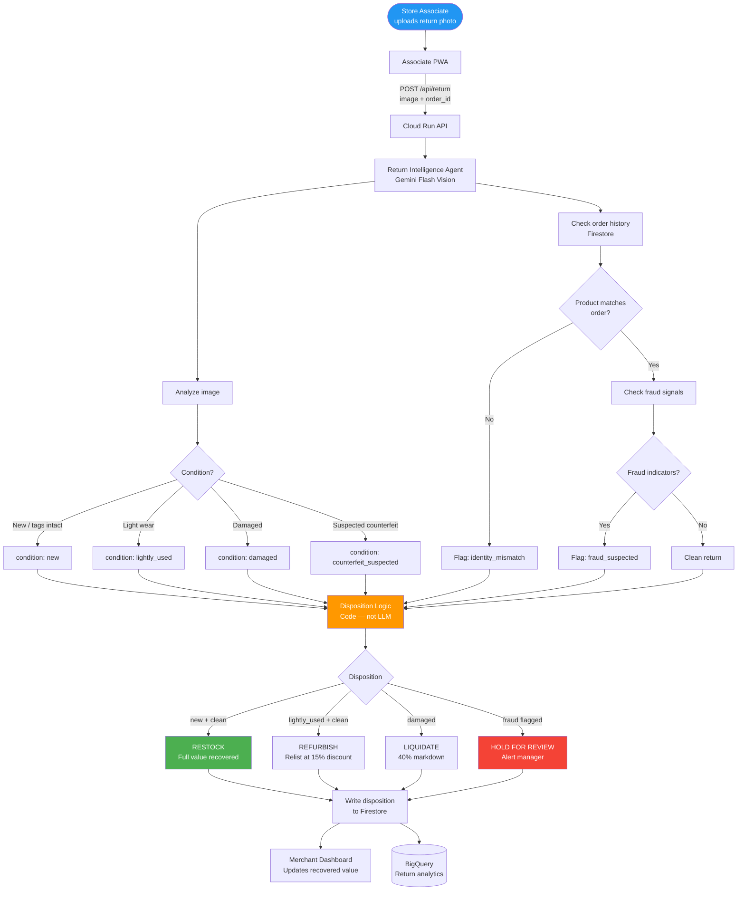

---

## 5. Insight Agent Pipeline Flow

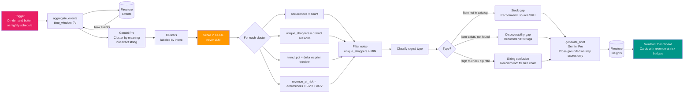

---

## 6. Cross-Platform Integration Flow

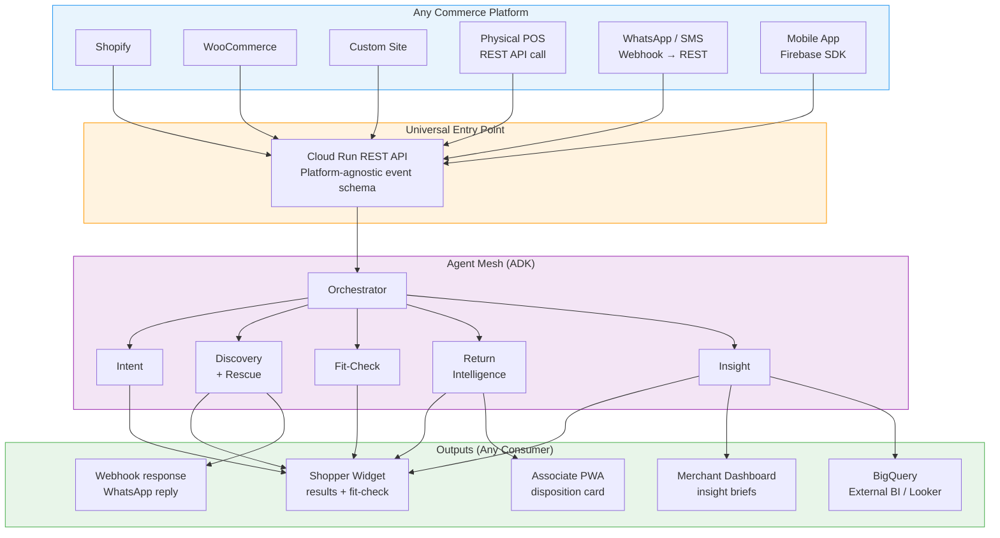

---

## 7. Mesh Architecture Extension & Gaps Plugged

```mermaid
flowchart TB
    subgraph EXISTING["Existing Agents"]
        DIS["Discovery + Rescue Agent"]
        FIT["Fit-Check Agent"]
        RET["Return Intelligence Agent"]
        INS["Insight Agent"]
        CAT["Catalog Import Agent"]
    end

    subgraph GAP1["Conversational Shopping - extends Discovery"]
        CS1["Guided Narrowing"]
        CS2["Use-Case Bundle Search"]
        CS3["Cart Concierge"]
        CS4["Visual + Voice Continuity"]
    end

    subgraph GAP2["Demand Planning - NEW agent"]
        DP0["Demand Planning Agent\nGemini Pro + BigQuery ML"]
        DP1["Forecast Bridge"]
        DP2["Auto-Reorder Draft"]
        DP3["Price Simulator"]
        DP4["Seasonal Brief"]
    end

    subgraph GAP3["Fraud - NEW agent"]
        FR0["Fraud Scoring Agent\nGemini Flash + Python rules"]
        FR1["Checkout Risk Score"]
        FR2["Return-Abuse Mining"]
        FR3["Promo Stacking Detector"]
        FR4["Counterfeit Screen"]
    end

    subgraph GAP4["Insights - extends Insight Agent"]
        IN1["Cross-Sell Signal"]
        IN2["Cohort Briefs"]
        IN3["Competitive Price-Gap"]
        IN4["Trend Drilldown"]
        IN5["Weekly Digest"]
    end

    DIS --> CS1
    DIS --> CS2
    DIS --> CS3
    DIS --> CS4
    INS --> DP0
    DP0 --> DP1
    DP1 --> DP2
    DP1 --> DP3
    DP1 --> DP4
    DIS -.->|"checkout_start event"| FR0
    FR0 --> FR1
    INS --> FR2
    FR0 --> FR3
    CAT --> FR4
    INS --> IN1
    INS --> IN2
    INS --> IN3
    INS --> IN4
    INS --> IN5
    CAT -.->|"competitor crawl reused"| IN3

    style GAP1 fill:#e8f4fd,stroke:#2196F3
    style GAP2 fill:#fce4ec,stroke:#E91E63
    style GAP3 fill:#fce4ec,stroke:#E91E63
    style GAP4 fill:#e0f2f1,stroke:#009688
```

Only two boxes are genuinely new agent processes (pink). Everything blue and teal is a new tool/function bolted onto an agent that already exists.

---

## 8. Conversational Shopping

### 8a. Pre-search intelligence — guided narrowing, bundle search, reference resolution

```mermaid
flowchart LR
    A1(["Shopper types or speaks a query"]) --> B1["extract_structured_intent\nGemini Flash"]
    B1 --> C1{"Reference to prior turn?\ne.g. it / that one"}
    C1 -->|"Yes"| D1["resolve_reference\nagainst session.intent_history"]
    C1 -->|"No"| E1{"2+ intent fields null\nAND query under 6 words?"}
    D1 --> E1
    E1 -->|"Yes"| F1["Ask ONE clarifying question\nGemini Flash"]
    F1 -->|"Shopper answers"| G1["Merge answer into\nStructuredIntent"]
    E1 -->|"No"| H1{"is_multi_item\nflag set?"}
    G1 --> H1
    H1 -->|"Yes"| I1["decompose_use_case\nGemini Flash to sub-needs array"]
    I1 --> J1["Python: budget_share x total\nto hard max_price per sub-need"]
    J1 --> K1["Run vector_search_catalog\nonce PER sub-need"]
    H1 -->|"No"| L1["Run vector_search_catalog\nonce, existing path"]
    K1 --> M1["Python: sum bundle total\nnever LLM-stated"]
    L1 --> N1["Grounded explanation\nGemini Flash"]
    M1 --> N1
    N1 --> O1(["Result cards or bundle shown"])

    style A1 fill:#2196F3,color:#fff
    style O1 fill:#4CAF50,color:#fff
    style F1 fill:#9C27B0,color:#fff
    style I1 fill:#9C27B0,color:#fff
```

**Key conditions:** clarifying question only fires on short + ambiguous queries (never adds a turn to an already-specific query) · bundle total is always the Python sum, never a number Gemini states · a sub-need with no match is shown as a gap, never silently dropped.

### 8b. Cart concierge — checkout-time policy Q&A

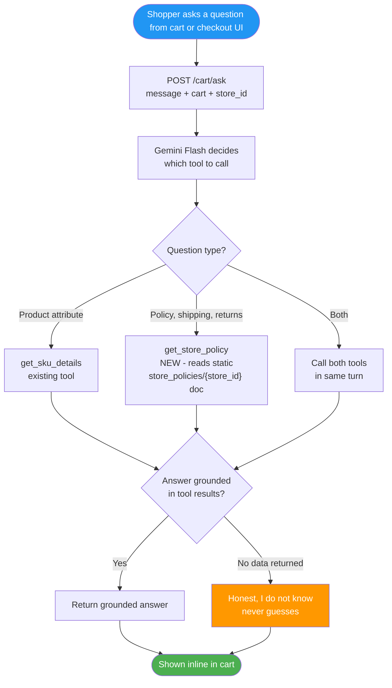

**Key conditions:** never answers from general knowledge — only from what a tool call returned · a question needing both tools must call both in the same turn, not pick one.

---

## 9. Demand Planning

### 9a. Search-signal-to-forecast bridge

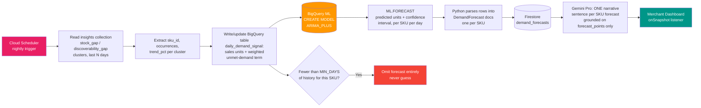

**Why `ARIMA_PLUS` and not Vertex AI Forecast:** single `CREATE MODEL` statement against data already sitting in BigQuery event mirror — right-sized for the catalog.
**Key conditions:** LLM narrative never states a number absent from `forecast_points` · demand signal boost is always traceable to specific `insights` documents.

### 9b. Forecast-driven actions

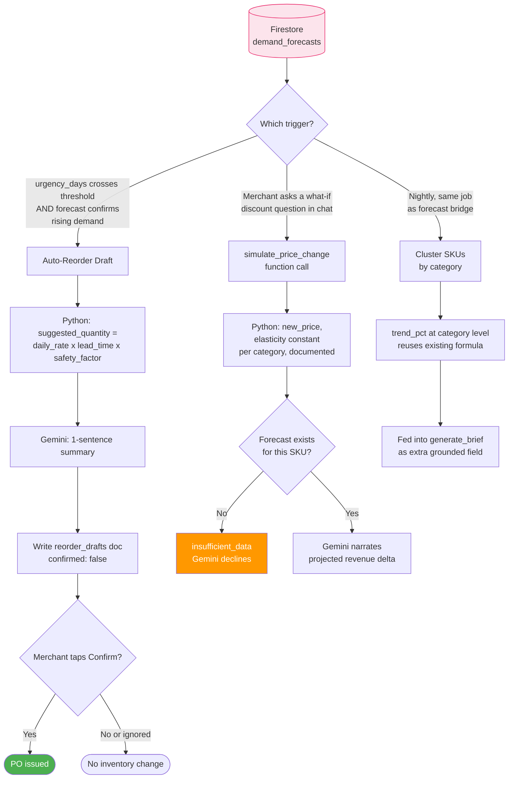

**Key conditions:** auto-reorder needs *both* urgency AND forecast agreement before drafting · nothing touches inventory before human taps Confirm.

---

## 10. Fraud Detection & Risk Scoring

### 10a. Checkout risk scoring (synchronous)

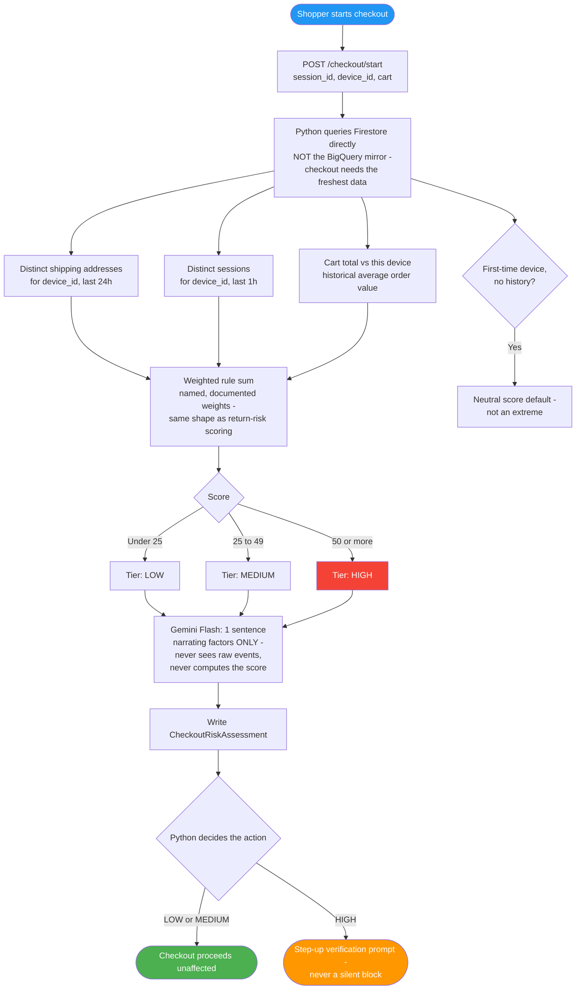

**Key conditions:** score must be 100% reproducible from the same input (unit-testable) · high tier never silently blocks, only steps up verification.

### 10b. Pattern-level fraud signals

```mermaid
flowchart TD
    subgraph RAM["Return-Abuse Pattern Mining - nightly, reuses Insight pipeline"]
        A6[("return_assessments\ncollection")] --> B6["Python: GROUP BY shopper identity -\nnot semantic clustering"]
        B6 --> C6{"3+ high-risk-tier returns\nfor same shopper?"}
        C6 -->|"Yes"| D6["New signal_type:\nreturn_abuse_pattern"]
        C6 -->|"No"| E6["No signal"]
    end

    subgraph PROMO["Promo / Coupon Stacking - at promo-apply time"]
        F6["POST /cart/apply-promo"] --> G6["Python: other sessions sharing\ndevice_id or an email-alias pattern,\nalready used this code?"]
        G6 -->|"Match"| H6["Write PromoAbuseFlag\nlinking session IDs"]
        G6 -->|"No match"| I6["Discount applied normally"]
        H6 --> J6["Gemini narrates in merchant chat -\nNOT a real-time checkout block"]
    end

    subgraph CTR["Counterfeit Listing Screen - during Catalog Import Stage 2"]
        K6["Product image\nin import batch"] --> L6["Gemini Vision - narrow prompt:\nwatermarks, mismatched branding,\nduplicate reuse ONLY"]
        L6 --> M6{"needs_review flagged?"}
        M6 -->|"Yes"| N6["Confidence score capped -\nforced into admin preview step"]
        M6 -->|"No"| O6["Normal Stage 3 normalization"]
    end

    style D6 fill:#f44336,color:#fff
    style H6 fill:#FF9800,color:#fff
    style N6 fill:#FF9800,color:#fff
```

**Key conditions:** Vision pass in CTR only outputs plain visual reasoning — never a "counterfeit" label directly (human makes call in preview step) · promo stacking flags for review rather than blocking.

---

## 11. Deepened Insights Pipeline

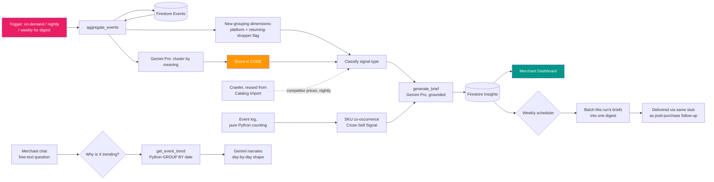

**Key conditions:** competitor price crawl is additive — falls back to budget-only comparison if no SKU match found · trend numbers strictly from Python `GROUP BY`.

---

## 12. Event Schema (Shared Across All Flows)

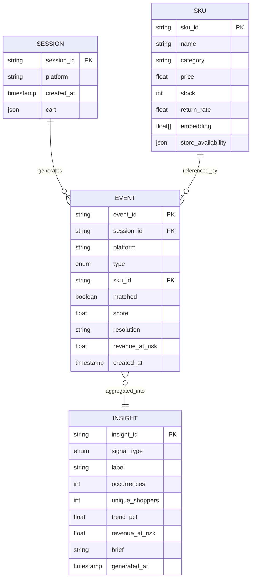

---

## 13. Diagram Color Key

| Color | Meaning |
|---|---|
| Blue | Entry point / trigger |
| Green | Successful, unblocked outcome |
| Orange | Guardrail branch — honest decline, review-required, or step-up flow |
| Red | Held-for-review / high-risk outcome |
| Purple | A point where Gemini generates something new (question, decomposition) rather than just retrieving or narrating |
