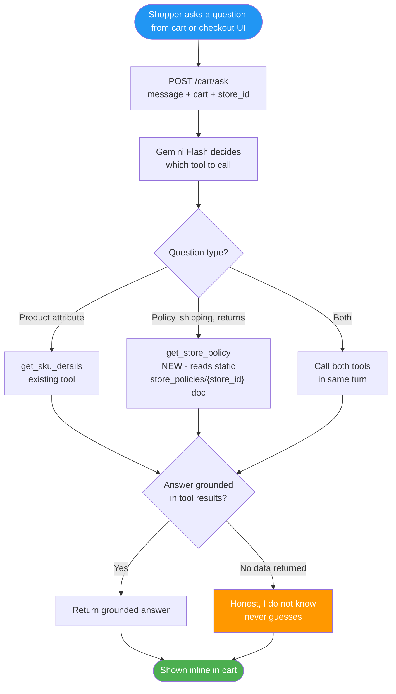
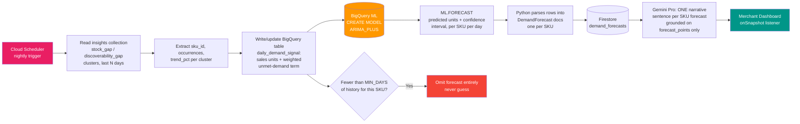
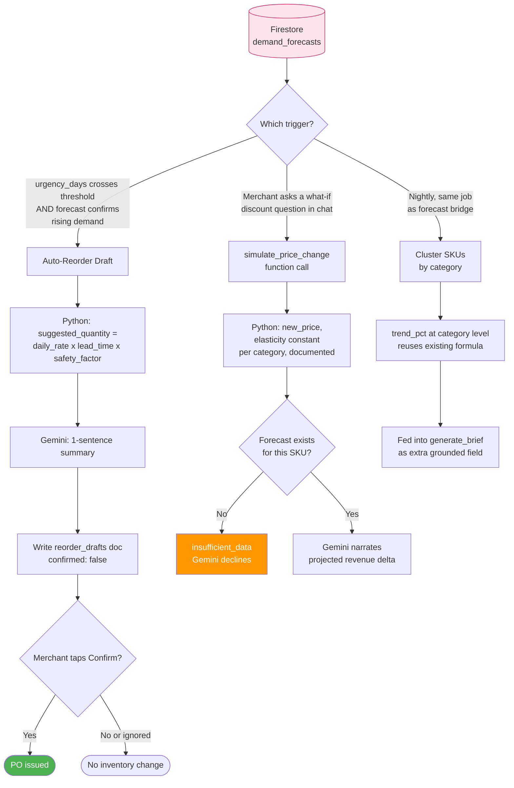
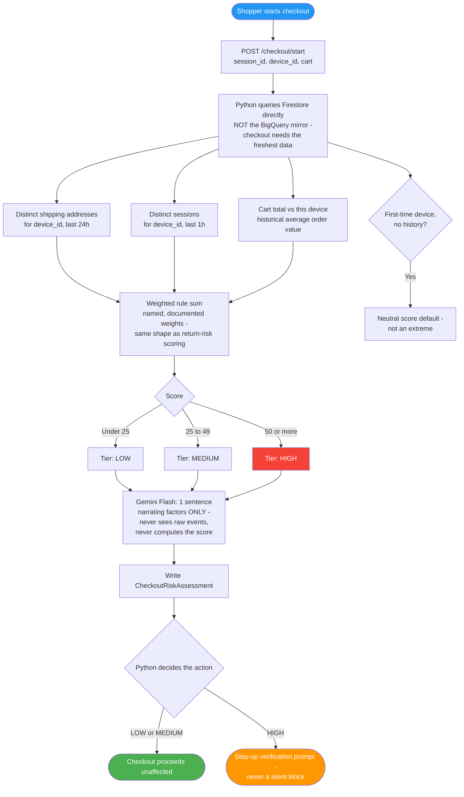
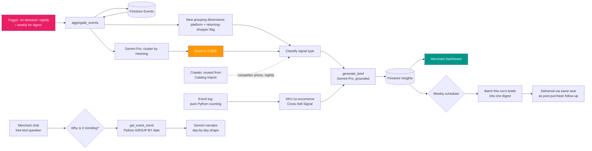

# OffGrid AI — New Flow Diagrams
### Conversational Shopping · Demand Planning · Fraud · Insights

**Companion to `flow_diagram.md`.** Render with any Mermaid-compatible viewer (GitHub, GitLab, Obsidian, mermaid.live). Node and edge labels carry the tech (Gemini model, GCP service) and trigger conditions directly, same convention as the existing scenario diagrams — the diagram *is* the spec, not just an illustration of one.

---

## 0. Where these plug into the existing mesh

```mermaid
flowchart TB
    subgraph EXISTING["Existing Agents"]
        DIS["Discovery + Rescue Agent"]
        FIT["Fit-Check Agent"]
        RET["Return Intelligence Agent"]
        INS["Insight Agent"]
        CAT["Catalog Import Agent"]
    end

    subgraph GAP1["Conversational Shopping - extends Discovery"]
        CS1["Guided Narrowing"]
        CS2["Use-Case Bundle Search"]
        CS3["Cart Concierge"]
        CS4["Visual + Voice Continuity"]
    end

    subgraph GAP2["Demand Planning - NEW agent"]
        DP0["Demand Planning Agent
Gemini Pro + BigQuery ML"]
        DP1["Forecast Bridge"]
        DP2["Auto-Reorder Draft"]
        DP3["Price Simulator"]
        DP4["Seasonal Brief"]
    end

    subgraph GAP3["Fraud - NEW agent"]
        FR0["Fraud Scoring Agent
Gemini Flash + Python rules"]
        FR1["Checkout Risk Score"]
        FR2["Return-Abuse Mining"]
        FR3["Promo Stacking Detector"]
        FR4["Counterfeit Screen"]
    end

    subgraph GAP4["Insights - extends Insight Agent"]
        IN1["Cross-Sell Signal"]
        IN2["Cohort Briefs"]
        IN3["Competitive Price-Gap"]
        IN4["Trend Drilldown"]
        IN5["Weekly Digest"]
    end

    DIS --> CS1
    DIS --> CS2
    DIS --> CS3
    DIS --> CS4
    INS --> DP0
    DP0 --> DP1
    DP1 --> DP2
    DP1 --> DP3
    DP1 --> DP4
    DIS -.->|"checkout_start event"| FR0
    FR0 --> FR1
    INS --> FR2
    FR0 --> FR3
    CAT --> FR4
    INS --> IN1
    INS --> IN2
    INS --> IN3
    INS --> IN4
    INS --> IN5
    CAT -.->|"competitor crawl reused"| IN3

    style GAP1 fill:#e8f4fd,stroke:#2196F3
    style GAP2 fill:#fce4ec,stroke:#E91E63
    style GAP3 fill:#fce4ec,stroke:#E91E63
    style GAP4 fill:#e0f2f1,stroke:#009688
```

Only two boxes are genuinely new agent processes (pink). Everything blue and teal is a new tool/function bolted onto an agent that already exists.

---

## 1. Conversational Shopping

### 1a. Pre-search intelligence — guided narrowing, bundle search, reference resolution

All three live inside the same intent-extraction step, which is why they're one diagram, not three.

```mermaid
flowchart LR
    A1(["Shopper types or speaks a query"]) --> B1["extract_structured_intent
Gemini Flash"]
    B1 --> C1{"Reference to prior turn?
e.g. it / that one"}
    C1 -->|"Yes"| D1["resolve_reference
against session.intent_history"]
    C1 -->|"No"| E1{"2+ intent fields null
AND query under 6 words?"}
    D1 --> E1
    E1 -->|"Yes"| F1["Ask ONE clarifying question
Gemini Flash"]
    F1 -->|"Shopper answers"| G1["Merge answer into
StructuredIntent"]
    E1 -->|"No"| H1{"is_multi_item
flag set?"}
    G1 --> H1
    H1 -->|"Yes"| I1["decompose_use_case
Gemini Flash to sub-needs array"]
    I1 --> J1["Python: budget_share x total
to hard max_price per sub-need"]
    J1 --> K1["Run vector_search_catalog
once PER sub-need"]
    H1 -->|"No"| L1["Run vector_search_catalog
once, existing path"]
    K1 --> M1["Python: sum bundle total
never LLM-stated"]
    L1 --> N1["Grounded explanation
Gemini Flash"]
    M1 --> N1
    N1 --> O1(["Result cards or bundle shown"])

    style A1 fill:#2196F3,color:#fff
    style O1 fill:#4CAF50,color:#fff
    style F1 fill:#9C27B0,color:#fff
    style I1 fill:#9C27B0,color:#fff
```

**Key conditions:** clarifying question only fires on short + ambiguous queries (never adds a turn to an already-specific query) · bundle total is always the Python sum, never a number Gemini states · a sub-need with no match is shown as a gap, never silently dropped.

### 1b. Cart concierge — checkout-time policy Q&A

**Key conditions:** never answers from general knowledge — only from what a tool call returned · a question needing both tools must call both in the same turn, not pick one.

---

## 2. Demand Planning — currently the weakest category

### 2a. Search-signal-to-forecast bridge (the core new capability)

**Why `ARIMA_PLUS` and not Vertex AI Forecast:** the latter is built for 100M-row catalogs with years of history; `ARIMA_PLUS` is a single `CREATE MODEL` statement against data already sitting in the BigQuery event mirror you've already built — right-sized for a new catalog, with the same table structure carrying forward if you outgrow it.

**Key conditions:** the LLM narrative never states a number absent from `forecast_points` · demand signal boost is always traceable to specific `insights` documents (audit trail).

### 2b. Forecast-driven actions

**Key conditions:** auto-reorder needs *both* urgency AND forecast agreement before drafting — one noisy signal alone never triggers a PO draft · nothing touches inventory before a human taps Confirm.

---

## 3. Fraud — also a real gap

### 3a. Checkout risk scoring (the core new capability, synchronous)

**Why Python rules and not BigQuery ML anomaly detection:** anomaly models need meaningful volume of *normal* checkout history to model against, which a new system doesn't have yet, and their scores are hard to explain to a store associate. Named, weighted rules are explainable from day one — the same reasoning this project already applied once to return-risk tiering.

**Key conditions:** score must be 100% reproducible from the same input (unit-testable) · high tier never silently blocks — it only steps up verification.

### 3b. Pattern-level fraud signals

```mermaid
flowchart TD
    subgraph RAM["Return-Abuse Pattern Mining - nightly, reuses Insight pipeline"]
        A6[("return_assessments
collection")] --> B6["Python: GROUP BY shopper identity -
not semantic clustering"]
        B6 --> C6{"3+ high-risk-tier returns
for same shopper?"}
        C6 -->|"Yes"| D6["New signal_type:
return_abuse_pattern"]
        C6 -->|"No"| E6["No signal"]
    end

    subgraph PROMO["Promo / Coupon Stacking - at promo-apply time"]
        F6["POST /cart/apply-promo"] --> G6["Python: other sessions sharing
device_id or an email-alias pattern,
already used this code?"]
        G6 -->|"Match"| H6["Write PromoAbuseFlag
linking session IDs"]
        G6 -->|"No match"| I6["Discount applied normally"]
        H6 --> J6["Gemini narrates in merchant chat -
NOT a real-time checkout block"]
    end

    subgraph CTR["Counterfeit Listing Screen - during Catalog Import Stage 2"]
        K6["Product image
in import batch"] --> L6["Gemini Vision - narrow prompt:
watermarks, mismatched branding,
duplicate reuse ONLY"]
        L6 --> M6{"needs_review flagged?"}
        M6 -->|"Yes"| N6["Confidence score capped -
forced into admin preview step"]
        M6 -->|"No"| O6["Normal Stage 3 normalization"]
    end

    style D6 fill:#f44336,color:#fff
    style H6 fill:#FF9800,color:#fff
    style N6 fill:#FF9800,color:#fff
```

**Key conditions:** the Vision pass in CTR may only output a plain visual reason — it never outputs a "counterfeit" or "fraud" label; the human always makes that call in the preview step · promo stacking flags for review rather than blocking, since a shared household device is a real false-positive case.

---

## 4. Insights — deepened pipeline

One diagram: every item here is a new branch feeding the same `generate_brief` step your Insight Agent already has, not a parallel pipeline.

**Key conditions:** competitor price crawl is additive — if no reliable SKU match is found, the classifier falls back to budget-only comparison exactly as it does today · trend drilldown numbers always come from the Python `GROUP BY`, Gemini only narrates the shape.

---

## Reading the color key (consistent across all diagrams above)

| Color | Meaning |
|---|---|
| Blue | Entry point / trigger |
| Green | Successful, unblocked outcome |
| Orange | Guardrail branch — honest decline, review-required, or step-up flow |
| Red | Held-for-review / high-risk outcome |
| Purple | A point where Gemini generates something new (question, decomposition) rather than just retrieving or narrating |

*Companion documents: `flow_designs.md` (prose spec — what/how/tech/conditions for each flow), `flow_diagram.md`, `architecture.md`, `backend_implementation_plan.md`.*
